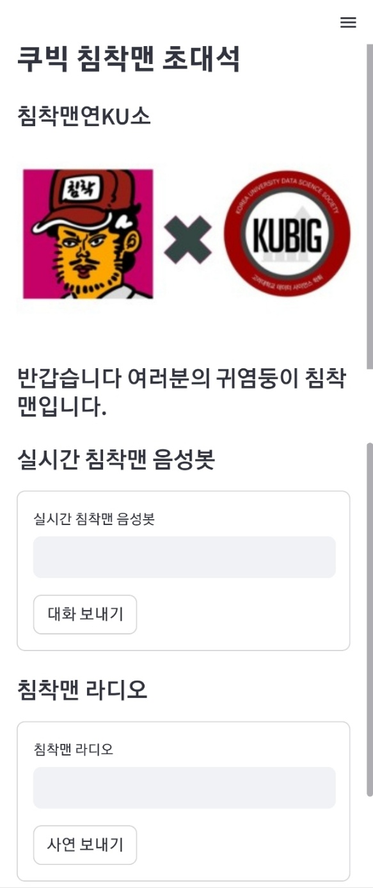

<h1 align="center"> 
23-1 KUBIG 침착맨 초대석
<h1/>
  
## 주제

Glow-tts와 HiFi-GAN을 통한 침착맨 음성학습 및 kogpt Next Token Prediction Fine-tuning을 통한 침착맨 음성봇 제작 프로젝트
  
## Team

<KUBIG 23-1> 

16기 최규빈
  
17기 임청수 홍여빈 황민아
  
## 코드

```bash
$ pip install -r requirements.txt
$ cd code
$ streamlit run run.py --server.port [server port]
```  
  
## 개발환경


## 구현 화면



  
  
